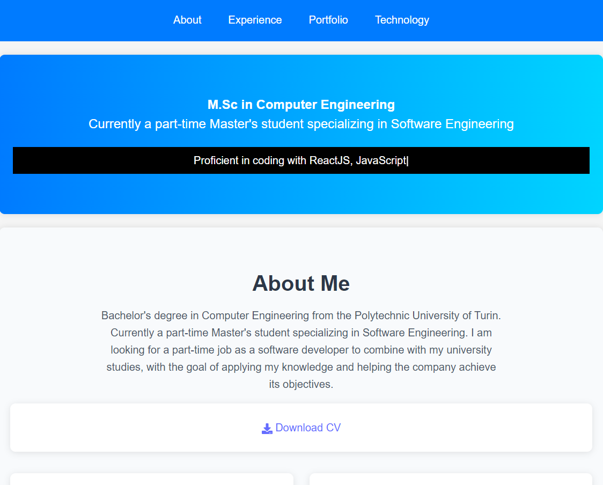
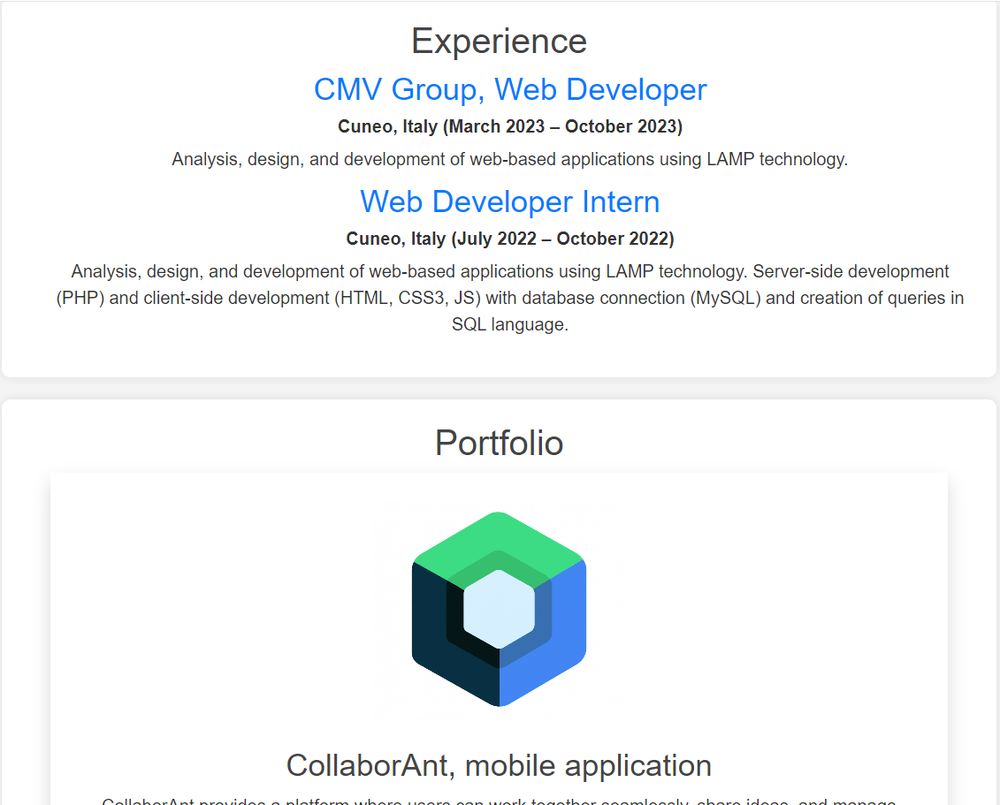

# HomeRoute Component

The `HomeRoute` component serves as the main entry point for the home page of the React application. It shows the resume page of the user.

## Table of Contents

- [Installation](#installation)
- [Component Structure](#component-structure)
- [Screenshots](#screenshots)
- [Docker](#docker)
- [Github Pages](#github-pages)
- [Kubernetes Deployment](#kubernetes-deployment)
- [License](#license)

## Installation

To use the react application, ensure you have a React environment set up.

```bash
npm install #to install the dependecies
npm run dev # to run the application
```
## Component Structure
The `HomeRoute` component is composed of several smaller, reusable components, each representing a distinct section of the home page. This modular design promotes separation of concerns and makes it easier to manage, maintain, and extend the application. Below are the main components included in the `HomeRoute`:

- **Header**: 
  - This component displays the navigation bar of the application, typically including links to different sections of the site. It enhances user navigation and accessibility.
  
- **Hero**: 
  - The Hero section serves as an introduction to the page. It often includes a prominent headline, a subheading, and a call-to-action button, capturing the user's attention and conveying the primary message of the site.
  
- **About**: 
  - This section provides information about the individual or organization. It typically contains a brief description, highlighting key achievements, values, or missions to give users a sense of who you are.
  
- **Education**: 
  - The Education component outlines the educational background of the individual or organization. It may include degrees earned, institutions attended, and any notable accomplishments during this period.
  
- **Resume**: 
  - The Resume section presents the user’s professional experience, skills, and qualifications. This can include work history, certifications, and relevant skills, providing a quick overview of professional background.
  
- **Portfolio**: 
  - This section showcases projects or work samples, allowing users to see the results of your efforts. It often includes images, descriptions, and links to the projects, highlighting your skills and creativity.
  
- **Technology**: 
  - The Technology component lists the tools and technologies that the individual or organization is proficient in. This section helps potential employers or clients understand your technical capabilities.
  
- **Footer**: 
  - The Footer contains copyright information, links to privacy policies, and any other relevant details that should be present at the bottom of the page. It often includes contact information or social media links.

Each of these components can be found in the `Sections` directory, and they can be modified independently, allowing for greater flexibility and reusability throughout your application.

## Screenshots

Here are some screenshots of the application:



<br>



## Docker
First run this commando to build your image on your pc
```bash
docker build -t my-vite-app .
```
Then to run your container you have to specified the port to run it(standard 3000, if you want to change also change the port in vite.config.js)
```bash
docker run -p 3000:3000 my-vite-app
```
Finally on Open your web browser and navigate to:
```http://localhost:portypuspecified/site/```

## Github Pages

To host your own website you have to follow some steps.
First install on your repo:
```bash
npm install gh-pages --save-dev
```
Then you have to modify the scripts on your package json in particular set:
```bash
  "scripts": {
  "predeploy": "npm run build",
  "deploy": "gh-pages -d dist"
  }
```
At the end you have to run 
```bash
npm run deploy ## if you using yarn(another package manager ) do yarn deploy
```
NB you will host your project on this url:  https://nickname.github.io/nameofrepository/ (in my case is PersonalSite, if you want to change you have also to modify the vite.config and app.js routes)

## Kubernetes Deployment
To deploy your application on Kubernetes, follow these steps:

### Push Docker Image to Docker Hub

1. **Login to Docker Hub**:
  ```bash
  docker login
  ```

2. **Tag your Docker image**:
  ```bash
  docker tag my-vite-app your-dockerhub-username/my-vite-app:latest
  ```

3. **Push the image to Docker Hub**:
  ```bash
  docker push your-dockerhub-username/my-vite-app:latest
  ```

### Create Kubernetes Deployment and Service

1. **Create a Deployment file (`deployment.yaml`)**:
  ```yaml
  apiVersion: apps/v1
  kind: Deployment
  metadata:
    name: my-vite-app-deployment
  spec:
    replicas: 3
    selector:
    matchLabels:
      app: my-vite-app
    template:
    metadata:
      labels:
      app: my-vite-app
    spec:
      containers:
      - name: my-vite-app
      image: your-dockerhub-username/my-vite-app:latest
      ports:
      - containerPort: 3000
  ```

2. **Create a Service file (`service.yaml`)**:
  ```yaml
  apiVersion: v1
  kind: Service
  metadata:
    name: my-vite-app-service
  spec:
    selector:
    app: my-vite-app
    ports:
    - protocol: TCP
      port: 80
      targetPort: 3000
    type: LoadBalancer
  ```

### Deploy to Kubernetes

1. **Apply the Deployment**:
  ```bash
  kubectl apply -f deployment.yaml
  ```

2. **Apply the Service**:
  ```bash
  kubectl apply -f service.yaml
  ```

3. **Check the status of your service**:
  ```bash
  kubectl get services
  ```

Once the service is up and running, you can access your application via the external IP provided by the LoadBalancer.
```bash
minikube service react-app-service --url
  ```

## License
This project is licensed under the MIT License. See the LICENSE file for more details.